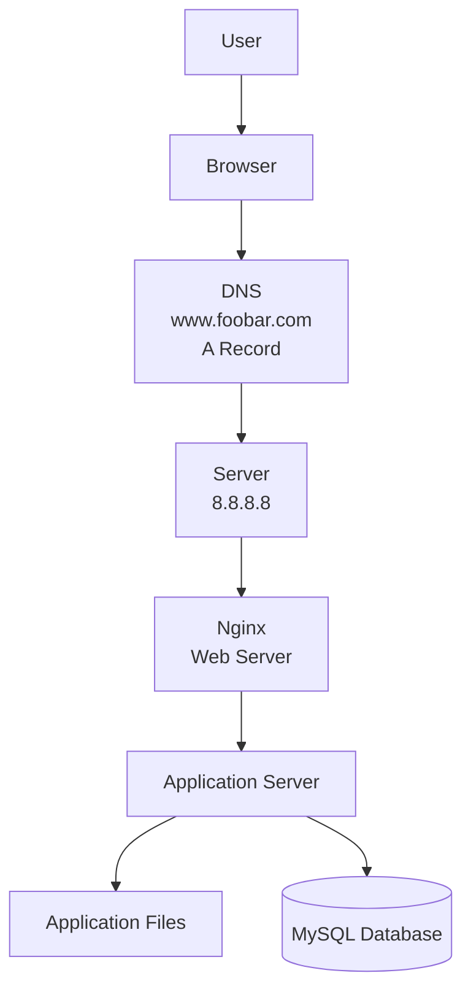

# Simple Web Stack

## Diagram

---

# Request Flow

1. The user enters **[www.foobar.com](http://www.foobar.com)** in the browser.
2. The browser queries DNS.
3. DNS returns the server IP address **8.8.8.8**.
4. The browser establishes an HTTP/HTTPS connection with the server.
5. Nginx receives the request.
6. Nginx forwards dynamic requests to the application server.
7. The application server executes the application code.
8. If data is required, the application server queries MySQL.
9. The response is returned to the user.

---

# Components

## Server

A physical or virtual machine that hosts the website and its services.

## Domain Name

Provides a human-readable name ([www.foobar.com](http://www.foobar.com)) instead of an IP address.

## DNS Record

The **www** record is an **A Record**, which maps the hostname to the IPv4 address **8.8.8.8**.

## Web Server (Nginx)

- Receives HTTP requests.
- Serves static files.
- Forwards dynamic requests to the application server.

## Application Server

Runs the application code and processes business logic.

## Database (MySQL)

Stores and retrieves application data.

## Communication Protocol

The server communicates with clients using **HTTP/HTTPS over TCP/IP**.

---

# Problems with this Infrastructure

## Single Point of Failure (SPOF)

The entire website depends on a single server. If the server fails, the website becomes unavailable.

## Downtime During Deployment

Deploying new code or restarting services can temporarily interrupt the website.

## Cannot Scale

A single server cannot efficiently handle a large amount of incoming traffic.
