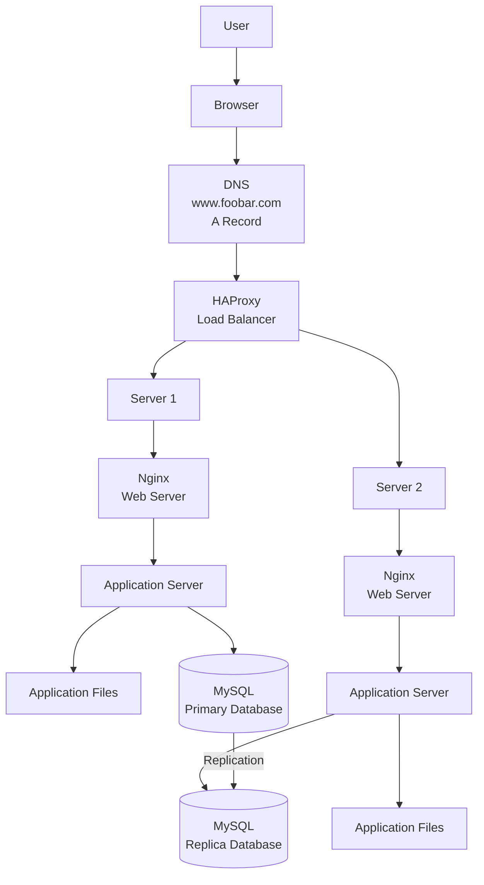

# Distributed Web Infrastructure

## Diagram

---

# Explanation

A user wants to access **[www.foobar.com](http://www.foobar.com)** from a browser.

The browser asks DNS to resolve **[www.foobar.com](http://www.foobar.com)**. DNS returns the IP address of the load balancer. The request reaches **HAProxy**, which distributes traffic between the two backend servers.

Each server contains:

- Nginx as the web server
- An application server
- A copy of the application files
- A MySQL database

---

# Why We Added Each Element

## HAProxy Load Balancer

HAProxy is added to distribute incoming traffic across multiple servers. This improves availability and helps the system handle more requests than a single server.

## Second Server

The second server adds redundancy and capacity. If one backend server fails, the other server can still serve traffic.

## Second Web Server

Each backend server has its own Nginx web server to receive requests forwarded by HAProxy.

## Second Application Server

Each backend server runs the application logic, allowing requests to be processed on more than one machine.

## Second Application Code Base

Each server has a copy of the application files so both servers can serve the same website.

## MySQL Primary-Replica Setup

The database is split into a Primary node and a Replica node to improve database availability and support read scaling.

---

# Load Balancer Algorithm

The load balancer is configured with the **Round Robin** algorithm.

Round Robin sends requests to each backend server one after another.

Example:

- Request 1 goes to Server 1
- Request 2 goes to Server 2
- Request 3 goes to Server 1
- Request 4 goes to Server 2

This helps distribute traffic evenly between available servers.

---

# Active-Active or Active-Passive

This infrastructure uses an **Active-Active** setup.

Both servers are active and receive traffic at the same time through the load balancer.

## Active-Active

All servers are running and handling traffic at the same time.

## Active-Passive

Only one server handles traffic. The second server stays on standby and is used only if the active server fails.

---

# Primary-Replica Database Cluster

In a Primary-Replica MySQL cluster, the Primary database handles write operations such as inserts, updates, and deletes.

The Replica database copies data from the Primary database through replication.

Usually:

- The Primary node handles writes.
- The Replica node can handle reads.
- Replication keeps the Replica updated with changes from the Primary.

---

# Difference Between Primary and Replica

## Primary Database

The application writes data to the Primary database.

Examples:

- Creating a user
- Updating a profile
- Creating a post
- Saving an order

## Replica Database

The application may read data from the Replica database.

Examples:

- Viewing a profile
- Reading posts
- Listing products

The Replica should not be used for normal write operations.

---

# Issues With This Infrastructure

## Single Points of Failure

There are still SPOFs:

- The load balancer is a SPOF. If HAProxy fails, users cannot reach the servers.
- The Primary database is a SPOF for write operations. If it fails, the application cannot write new data.

## Security Issues

This infrastructure has security problems:

- No firewall is protecting the servers.
- No HTTPS is configured, so traffic is not encrypted.
- Data could be intercepted between the user and the infrastructure.

## No Monitoring

There is no monitoring system.

Without monitoring, the team cannot easily detect:

- Server failure
- High CPU or memory usage
- Database problems
- Load balancer issues
- Application errors
