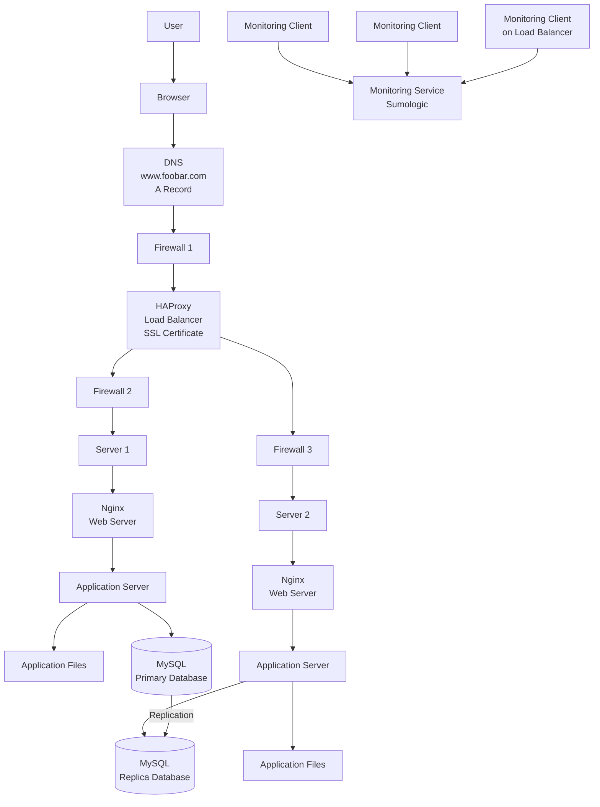

# Secured and Monitored Web Infrastructure

## Diagram

---

# Explanation

A user wants to access **[www.foobar.com](http://www.foobar.com)** from a browser.

The browser asks DNS to resolve **[www.foobar.com](http://www.foobar.com)**. DNS returns the IP address of the load balancer. The request passes through a firewall, then reaches HAProxy.

HAProxy has an SSL certificate installed, so it can serve the website over HTTPS. It distributes traffic between two backend servers.

Each backend server contains:

- Nginx web server
- Application server
- Application files
- MySQL database
- Monitoring client

---

# Additional Elements

## Firewalls

Firewalls are added to control network traffic and protect the infrastructure.

They allow only required traffic and block unauthorized access.

Examples:

- Allow HTTPS traffic on port 443.
- Allow SSH only from trusted IP addresses.
- Restrict database access to internal servers only.

## SSL Certificate

The SSL certificate is added to serve **[www.foobar.com](http://www.foobar.com)** over HTTPS.

HTTPS encrypts traffic between the user and the website. This protects sensitive data such as passwords, cookies, and personal information.

## Monitoring Clients

Monitoring clients collect system and application metrics from the servers and send them to a monitoring service such as Sumologic.

They help detect problems before users report them.

---

# What Monitoring Is Used For

Monitoring is used to track the health and performance of the infrastructure.

It can monitor:

- CPU usage
- Memory usage
- Disk usage
- Network traffic
- Web server status
- Application errors
- Database health
- Load balancer performance

---

# How Monitoring Collects Data

A monitoring client runs on each server.

The client collects logs and metrics, then sends them to a central monitoring service.

For example:

- Nginx access logs
- Nginx error logs
- System metrics
- Application logs
- MySQL metrics

---

# Monitoring Web Server QPS

To monitor web server QPS, which means Queries Per Second or Requests Per Second, we should collect and analyze Nginx access logs.

The monitoring system can count how many HTTP requests are received every second.

We can also configure Nginx metrics exporters or monitoring agents to send request rate metrics to the monitoring service.

---

# Issues With This Infrastructure

## SSL Termination at the Load Balancer

Terminating SSL at the load balancer means traffic is encrypted between the user and the load balancer, but it may be unencrypted between the load balancer and the backend servers.

This is a security issue because internal traffic could be inspected if the internal network is compromised.

## Only One MySQL Server Accepting Writes

Only the Primary MySQL server accepts write operations.

If the Primary database fails, the application cannot write new data.

This makes the Primary database a single point of failure for writes.

## Servers Having All Components

Each server contains a web server, application server, and database.

This can be a problem because different components have different resource needs.

For example:

- The database may need more disk and memory.
- The application may need more CPU.
- The web server may need network capacity.

Putting everything on the same servers makes scaling, maintenance, and troubleshooting harder.
