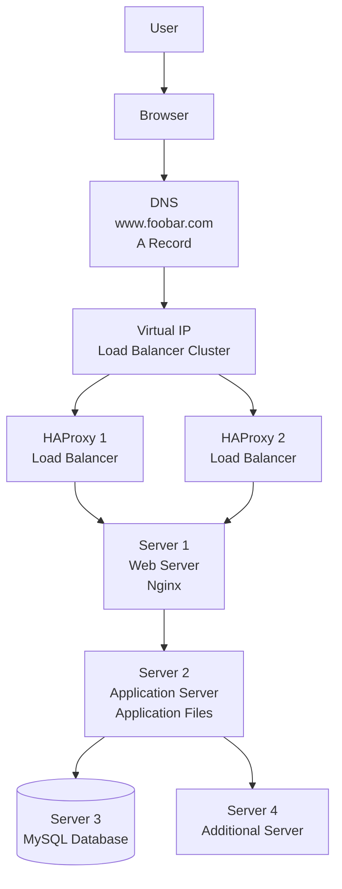

# Scale Up Web Infrastructure

## Diagram

---

# Explanation

A user wants to access **[www.foobar.com](http://www.foobar.com)** from a browser.

The browser asks DNS to resolve **[www.foobar.com](http://www.foobar.com)**. DNS returns the virtual IP address used by the HAProxy load balancer cluster.

The request reaches one of the HAProxy load balancers. The load balancer forwards the request to the web server. The web server receives the HTTP or HTTPS request and forwards dynamic requests to the application server.

The application server runs the application code and communicates with the MySQL database when data is needed.

---

# Additional Elements

## Additional Server

An additional server is added to scale the infrastructure and avoid placing all components on the same machines.

It gives the infrastructure more capacity and makes it easier to separate responsibilities.

## Second HAProxy Load Balancer

A second HAProxy load balancer is added and configured as a cluster with the first one.

This avoids having only one load balancer as a single point of failure.

If one load balancer fails, the other one can continue routing traffic.

## Load Balancer Cluster

The two HAProxy load balancers are configured as a cluster using a virtual IP address.

The virtual IP points to the active load balancer. If the active load balancer fails, the other load balancer takes over.

## Split Components

The infrastructure separates the main components:

- Web server on its own server
- Application server on its own server
- Database on its own server

This improves scalability, maintenance, and troubleshooting.

---

# Why Splitting Components Helps

## Web Server

The web server handles HTTP/HTTPS requests and serves static content.

Keeping it separate makes it easier to scale or tune the web layer.

## Application Server

The application server runs the application logic.

Keeping it separate allows independent deployment and scaling of the application layer.

## Database Server

The database stores persistent data.

Keeping it separate improves security, performance tuning, backups, and database management.

---

# Why This Design Is Better

This design is better than putting all components on the same servers because each layer can be managed independently.

If the application layer needs more resources, we can add more application servers.

If the database needs better disk performance, we can upgrade the database server without changing the web server.

If the web layer receives heavy traffic, we can scale the web server layer separately.
